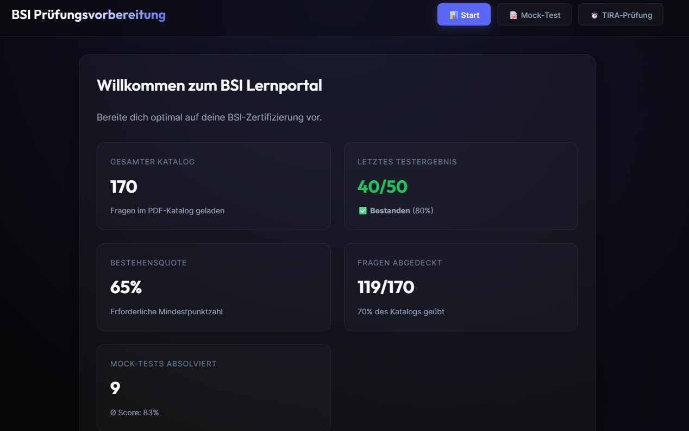

# BSI Prüfungsvorbereitung

Offline-Lernapp für die BSI IT-Sicherheitsprüfung (ITSP). 170 Fragen, Mock-Tests und simulierte Prüfung mit Zeitlimit. Läuft komplett ohne Internet.

---

## Voraussetzungen

**Node.js** muss einmalig installiert werden:

→ [nodejs.org](https://nodejs.org) aufrufen → „LTS" herunterladen → installieren → fertig.

---

## App starten

**Doppelklick auf `start.bat`**

Ein Browserfenster öffnet sich automatisch. Passwort eingeben (vom Kursanbieter erhalten) → fertig.

---

## Was die App kann

| Modus | Beschreibung |
|-------|-------------|
| **Mock-Test** | 20 zufällige Fragen mit direktem Feedback nach jeder Antwort |
| **ITSP-Prüfung** | 50 Fragen unter Prüfungsbedingungen, 50 Minuten Zeitlimit |
| **Dashboard** | Statistiken: Abdeckung, Testergebnisse, Fortschritt |

Bestehensgrenze: **65 %**

---

## Fehlerbehebung

| Problem | Lösung |
|---------|--------|
| „Node.js nicht gefunden" | Node.js von [nodejs.org](https://nodejs.org) installieren, dann `start.bat` neu starten |
| „Falsches Passwort" | Passwort beim Kursanbieter erfragen |
| Browser öffnet sich nicht | Manuell öffnen: [http://localhost:12121](http://localhost:12121) |
| Schwarzer Bildschirm / App hängt | `start.bat` schließen und erneut starten |

---

